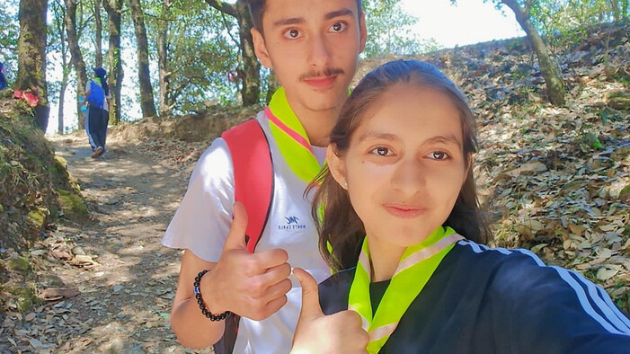
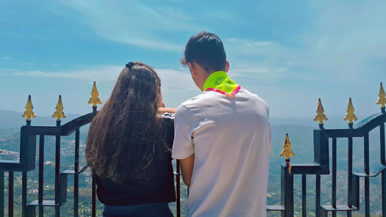
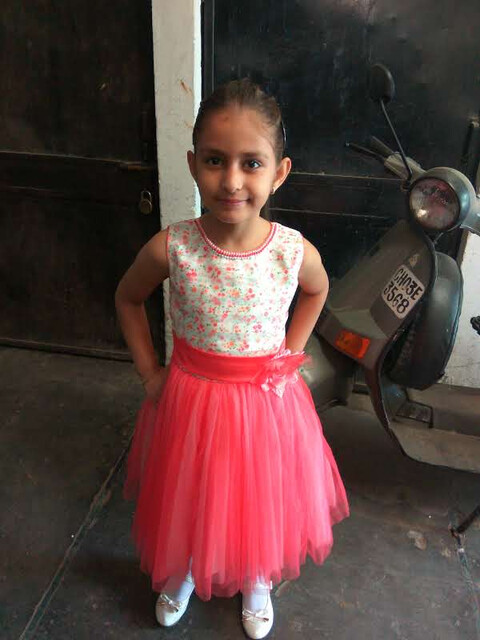
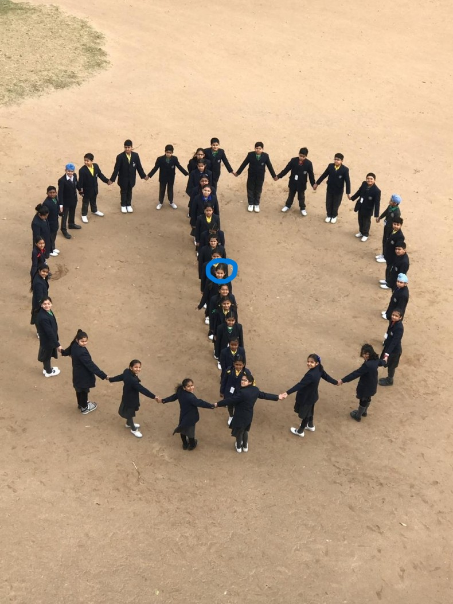
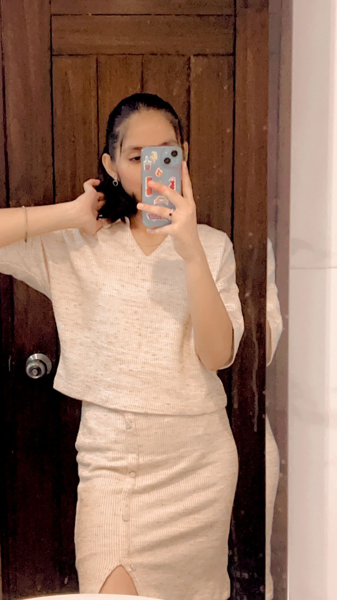
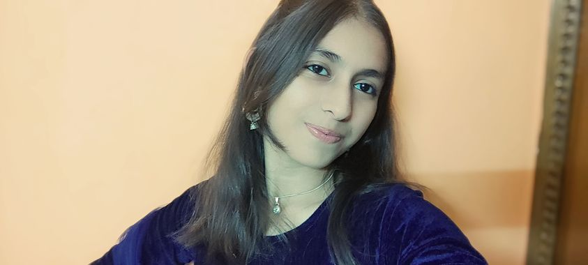

<html lang="en">
<head>
    <meta charset="UTF-8">
    <meta name="viewport" content="width=device-width, initial-scale=1.0">
    <title>For My Cutie Manya</title>
    <link href="https://fonts.googleapis.com/css2?family=Great+Vibes&family=Poppins:wght@300;400;600&display=swap" rel="stylesheet">
    
</head>
<body>

    <audio id="bg-music" loop>
        <source src="perfect.mp3" type="audio/mpeg">
    </audio>

    

    

        <h1>For Manya ❤️</h1>
        
Click the button below to start...

        <button onclick="startExperience()">Start Love Story</button>
    

    

        
        

            <h1>Hey cutieeee 😚</h1>
            
This is your man (one and only 🔪🔪🔪🔪🔪🔪).

            
I made this thing specially for youuuuuu.

            
I hope you like it..........

             
            
🎁

        

        

            

                So first of alll, I wanna thank you for being in my life cutieeeee. Aap ke aane pr na bohot si cheezein achiii huiii. I got a good life, got happier and started living like I still had something in me. I just felt all is over for me. But you came to my life and brightened it.   
                I wanna thank you for all the things youu did for meee Thank you cutieeee 😘😘😘😘. I just want to thank you for all the things you did for me. So lets talk about the last 3 years.
            

        

        

            <h1>December 2023</h1>
            
So the tale started on 1st December, 2023. Hayyee, That day was so good for the both of us. We started off as a fresh couple things were soo good for the first 5 days.

            
Then uk disaster struck and all the things happened. My hand broke 😢 and then all those things happened. But uk you stayed with me and that matters the most to me. I was really happy.

            
Fir humari kuchh time tak baat nhi ho paayi and later that Aarush guy also intervened but it was fine. We made it through the first month.

        

        

            <h1>2024: The 10th classss</h1>
            

                This year started and we didn't talk much iin the first month cuz of uk all the things that had happened. Fir we met on 23rd Jan and yrr, it was so so so good yrr. And jo tumne aakr mere arm ko pakda tha. Hayyee yrr mai itna khush tha uss din. It made my whole year yrr.  
                Fir sab kuchh normally chlta rha until 18th Feb, Mera haath tut gya 😢. And I coudn't see you for another month. It was too bad for me. Mtlb I used to wait for you everyday, and then finally we met again on 15th March And I was so relieved yrr. It felt like peace again. Fir har din achha chlta tha. Me seeing you, talking to you, making eye contacts sab cheezein bohot achhi thi.  
                Then came a really good moment. <strong>You kissed me on 25th Aprill !!!!!!!</strong> yrr vo itna pyaaraa tha na Like I always loveed it so muchhhh. But after that came something really bad. You started talking to Malik 😠😠. And tab mujhe itni chidhh hoti thi na I can't even explain it, but I didn't say anything..........
            

        

        

            <h1 style="font-size: 3rem;">The Shimla trip !!!!</h1>
            

                
                
                
            

            

                This was too lovely yrr. This was our first trip together and it was lovely. Pehla din bohot achha tha. We reached there. Had some fun. Bohot achha lga. Only downside was that you were still talking to that Malik guy 😒😒.  
                Anyways Then came the second day, and hayye yrr, you were so sexyyyy. Mast lag rhi thi. We went to the mandir that day, and uk, on the way back you fell twice 😂😂. I picked you up both of the times. Mera chhotta sa bachha ho aap.  
                Fir came the third day. And that was bilkul peak. Mtlb yrr we were going together while you were holding my arm. Hayee yr, I would do anything to get that feeling again. And it was soo good. At last yrr, you even cried cuz of we were gonna leave. But dw, we'll do another trip sooon.........
            

        

        

            <h1>And fir life chlti rhi...</h1>
            

                We met everyday, and everything went good, especially that cultural part, it was soo soo soo good yrr. I got to see you everyday, and you always looked so hot to me. Mtlb koi ldki itni achii ho vi kese skti hai I coudn't even imagine. We saw each other everyday, Aapko dance krte dekh mai pighal jaata tha. Itni sundar mahila sirf mujhe mile aur kisi ko na mile. You're so only mineeeeeee😘😘😘😘.  
                Fir ese hi hmara year khtm hua and 2025 started. And we had our first lip kiss on 7th Jan. And it was soo fucking good yrr. Mtlb the first kiss was so good that it still lives as the best memories in my heart. Itni achhi thi voh. Fir baad mei papers aa gye and all. We coudn't talk much but stilll we made it through.  
                Fir hume firse mile 18th Feb ko and 7th March ko and humne jo sab vi kiya, Tbh it was worth it. My love language is physical touch and I could express my feelings to you. So it was good.  
                Uske baad many things happened... I would just say that It's all my fault, and as a man I coudn't control my problems. I assure you that esa aage chl kr kbhi nhi hoga. Have faith in me. I'll do everything to make upto you. Fir humne October mei firse baat shuru ki and we did a lot of wrong things. For them too I can assure you ki esa kbhi nhi hoga till our marriage.  
                Dw, I'll always be there for you. So aap kbhi mat sochna ki mai kbhi aapko chhod kr jaunga. Just know one thing, If I ever say it, It's not who I am, Its someone else. And you have to bring me back. Okieee ???? Bss abhi tak to itna hi hua hai. Baaki hum dekhte hai aage kya hota hai. Jo bhi ho, hum saath rhenge. Hmesha ke liye. We'll have kids and grow old, so take care of yourself, achhe se khana khaya kro and apni dhyan rkha krooooo Okaa 😚.
            

        

        

            <h1>My Beautiful Manya</h1>
            
            

                
                
This is my cutiee when she was smalllllll 😚😚😚😚😚 !!!!!

            

            

                
                
There is my cute sa bachha in 5th 🥰🥰🥰🥰

            

            

                
                
Oh my cutieee is so so so beeautiful 😍😍😍😍😍😍😍😍😍

            

            

                
                
My lovely sa bachha on Diwali.. So gorgeoussss 🥵🥵

            

        

        

            <h1>Promises...</h1>
            

                Haan to mere cutu, at last I just wanna say ki thank you for being with me through this whole timee. You were so good to me and I want you to be the same withme in the future. Aapke jese mujhe kbhi nhi mil skta, aur agr mere life mei koi ldki aane ki try krti hai, I'll throw her away in the ocean. Aapke alawa mere liye koi aur ldki (except my mum) doesn't matter.  
                And that's all I wanna say. I want ki hum bade ho ek saath, Hmare do bachhe ho, We life a happy life. And we see each other grow together. This is my dream and I hope so yours too. I just want ki aap dusre ldko se dur rho, and listen to me. This is my only wish for you. Bss itna krdo aap, I'll stay with you for eternity.  
                Chlo I won't waste much of your timee. Aap maze kro okieeee. Bie bie cutieeeee. I love ya bohot bohot bohot saara 😘😘😘😘. Stay happy and just do the two things I said you to doo. Plzzz 🥺🥺🥺🥺.
            

            <h2 class="auberge-text">Love, Rajbir Singh  (Your one and only man)</h2>
        

        

            <button onclick="changeSlide(-1)">Back 🔙</button>
            <button onclick="changeSlide(1)">Next ❤️</button>
        

    

    
</body>
</html>
